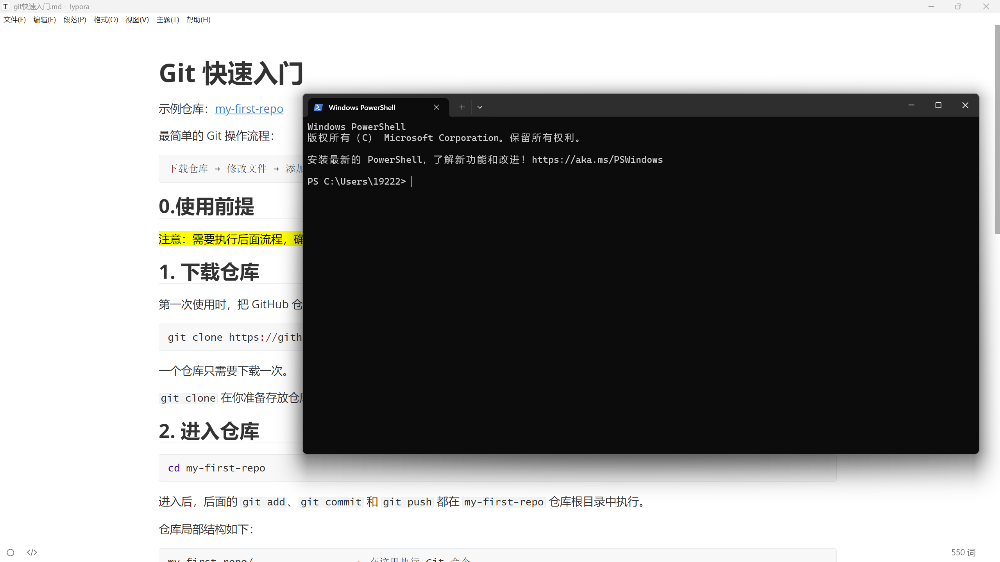
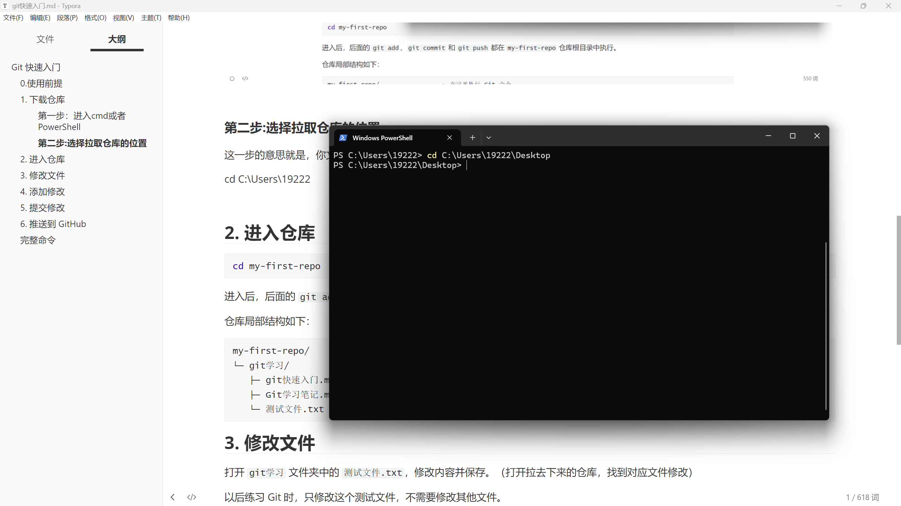
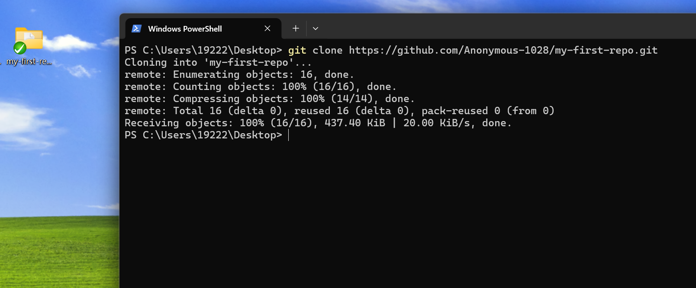
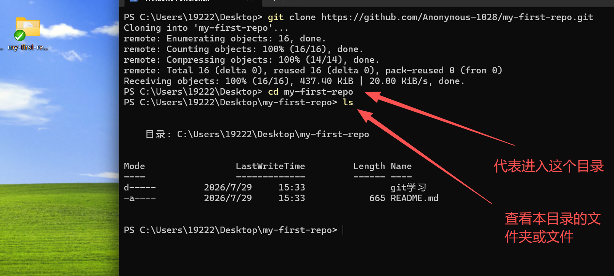
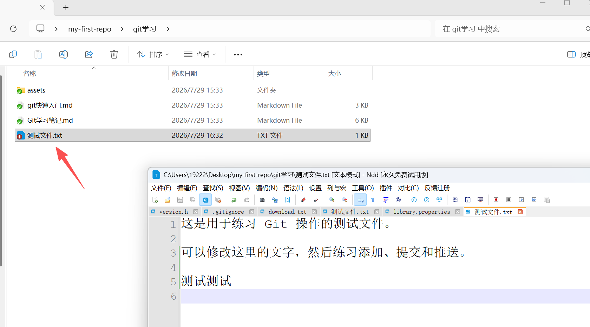
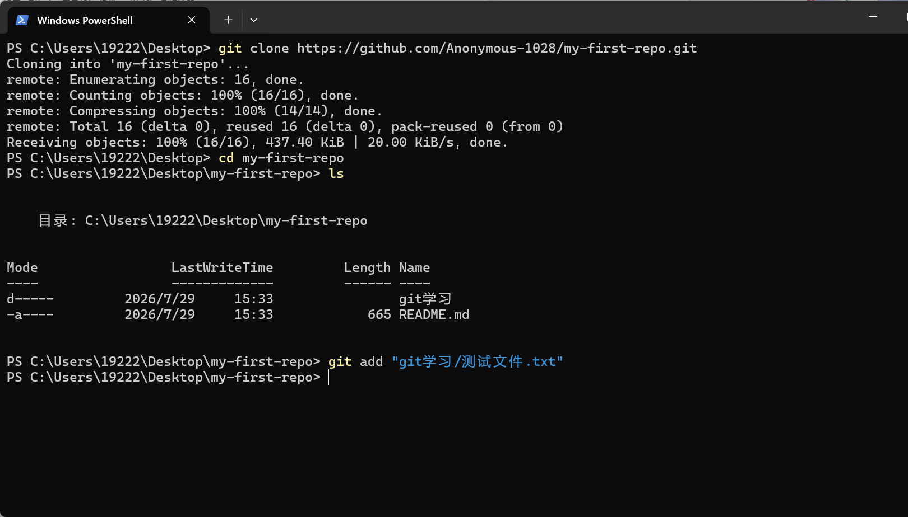
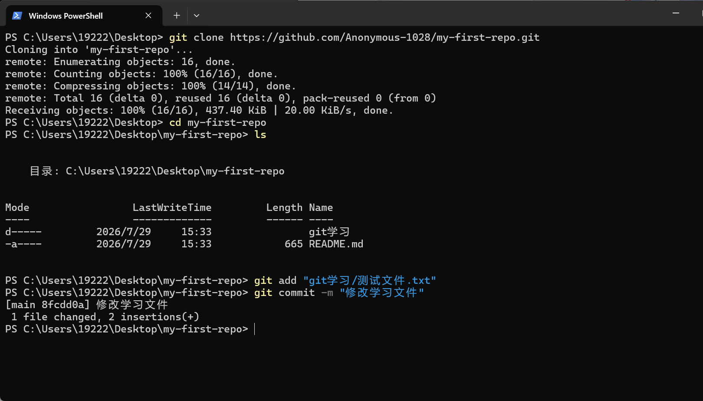
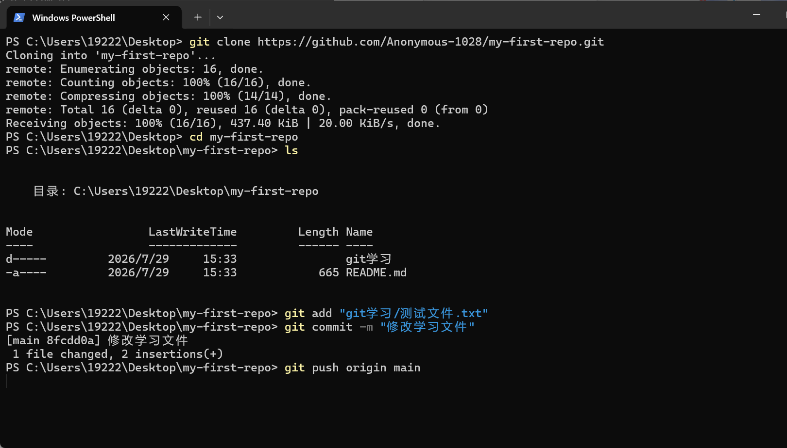
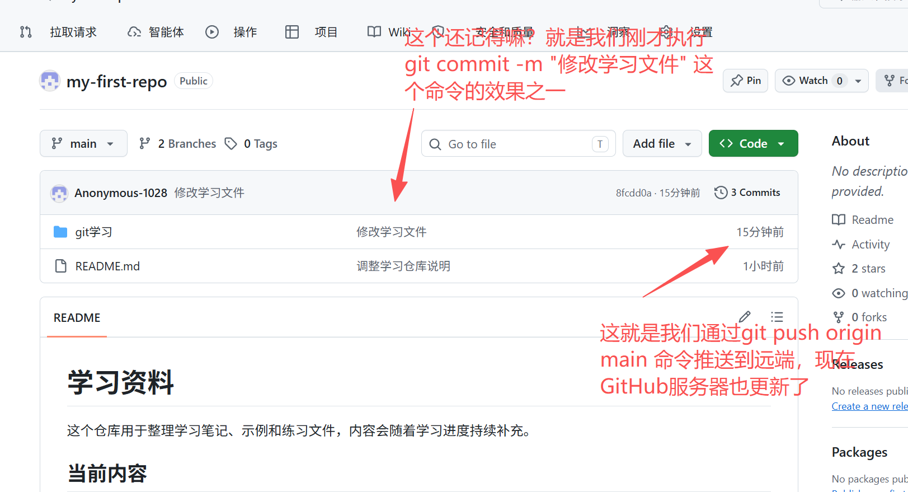

# Git 快速入门

示例仓库：[my-first-repo](https://github.com/Anonymous-1028/my-first-repo)

最简单的 Git 操作流程：

```text
下载仓库 → 修改文件 → 添加修改 → 提交修改 → 推送到 GitHub
```

## 0. 安装 Git

开始后面的操作前，需要先在电脑上安装 Git：

- [Git 安装教程](https://www.yuque.com/icheima/arm32/bgbgz6dgoc1amp0f)

安装完成后，打开 CMD 或 PowerShell，执行：

```powershell
git --version
```

如果能够看到类似下面的版本号，说明 Git 已安装成功：

```text
git version 2.x.x.windows.x
```

确认安装成功后，再继续下面的仓库下载和提交操作。

## 1. 下载仓库

第一次使用时，把 GitHub 仓库下载到电脑：

```powershell
git clone https://github.com/Anonymous-1028/my-first-repo.git
```

一个仓库只需要下载一次。

`git clone` 在你准备存放仓库的目录中执行。下载完成后，进入仓库再执行后续命令。


示例:下载 `my-first-repo.git` 仓库

#### 1.1 进入cmd或者PowerShell




#### 1.2 选择拉取仓库的位置

这一步的意思就是给你要文件找个地方，本文档为了简单明了，就选择在桌面

```powershell
cd C:\Users\19222\Desktop
```



#### 1.3 拉取GitHub上的代码库

将该命令输入到cmd/Powershell执行，如图

```powershell
git clone https://github.com/Anonymous-1028/my-first-repo.git
```

执行完后你就可以看到你桌面上出现一个与文件夹，这个文件夹与你拉取仓库名字一样就是拉取成功了。




## 2. 进入仓库

和前面一样输入在这个黑框框里面

```powershell
cd my-first-repo
```



## 3. 修改文件

打开 `git学习` 文件夹中的 `测试文件.txt`，修改内容并保存。

以后练习 Git 时，只修改这个测试文件，不需要修改其他文件。



## 4. 添加修改

```powershell
git add "git学习/测试文件.txt"
```

这条命令表示：准备把 `测试文件.txt` 的修改放入本次提交。命令仍然是在 `my-first-repo` 根目录中执行。



如果修改了多个文件，也可以一次添加全部修改：(直接使用这个也是一样的)

```powershell
git add .
```

## 5. 提交修改

```powershell
git commit -m "修改学习文件"
```

这条命令把刚才添加的修改保存为一个本地版本。引号中的文字用于说明这次修改了什么。



## 6. 推送到 GitHub

```powershell
git push origin main
```

这条命令把本地提交上传到 GitHub。推送成功后，刷新仓库网页就能看到修改。



执行上图这个命令后，如图下所示



## 完整命令

第一次下载并进入仓库：

```powershell
git clone https://github.com/Anonymous-1028/my-first-repo.git
cd my-first-repo
```

修改并保存文件后执行：

```powershell
git add "git学习/测试文件.txt"
git commit -m "修改测试文件"
git push origin main
```
