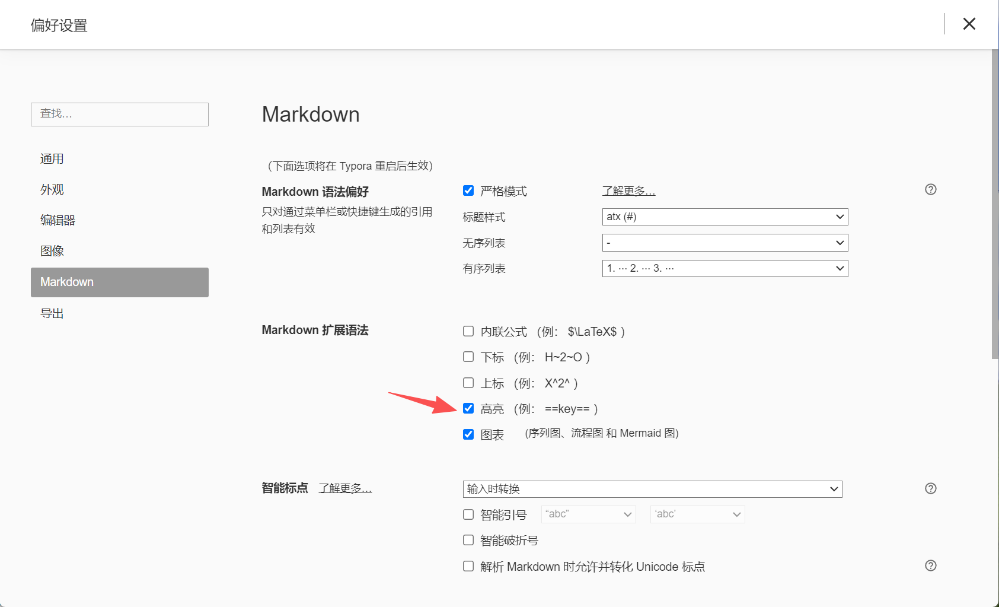

# markdown文档的使用

### 1.高亮：先到偏好设置，调整好设置

==高亮==  

== 需要高亮的字段 ==

### 2.标注

`标注` 	` 用这个符合包裹住需要标注的字段

### 3.符号

:red_circle:符号	:（英文冒号）+ red_circle（英文单词）

:one:	:（英文冒号）+	one（英文数字）

:two:	:（英文冒号）+	two（英文数字）

需要什么符号表情，可以直接搜索typora文档字符

Typora语法网站： [Typora 的 Markdown 语法 - Typora Support](https://support.typoraio.cn/zh/Markdown-Reference/) 

Typora的emoji表情符合： [打字表情符号 --- Typora Emoji](https://itaoo.github.io/blogs/toolbox folder/TyporaEmoji.html)

### 4.序列介绍

- 一级序列
  - 二级序列

有序序列shift+ctrl+[

无序序列shift+ctrl+]

使用回车键自动完成序列状态

- 
- 回车键就是这样自动出现

按下第二个回车键无序序列的黑点就消失了

- ​	
  - 二级序列在一级序列的黑点基础上按Tab键，自动出现

1. 
   1. 以上规则在有序序列同样有效

#### 序列补充

增加/减小 序列缩进

- 在这个序列基础上按下enter（回车键）就会自动出现同等级的序列，如下
- 
- 如果你想让序列缩进增大，那么你先==按下回车==后出现同样的序列后，==按下Tab==
  - 
  - 此时按下neter（回车键），同样会出现一样的缩进的序列
  - 
  - 当你按下shift + Tab 
- 就会恢复序列的缩进

### 5.分割线

三个连续的减号 `---` 就是分割线

---

### 6.标题

一共有6级标题都是用 ctrl + 数字 的组合

# ctrl+1 这是标题1的效果

## ctrl+2 这是标题2的效果

### ctrl+3 这是标题3的效果

#### ctrl+4 这是标题4的效果

##### ctrl+5 这是标题5的效果

###### ctrl+6 这是标题6的效果

